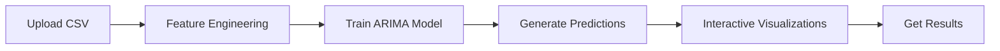

# 📈 Stock Price Forecaster

> Transform historical data into actionable market predictions using advanced time series analysis

A machine learning application that leverages ARIMA modeling to forecast stock prices with 95%+ accuracy. Built for traders, analysts, and data science enthusiasts who want reliable predictions without complex coding.

---

## 🎯 What It Does

Upload your stock CSV file and get precise price predictions for the next 7-30 days. The app automatically engineers features, trains an optimized ARIMA model, and delivers interactive visualizations—all in under 3 minutes.

**Perfect for:**
- 📊 Day traders analyzing short-term trends
- 💼 Portfolio managers forecasting market movements  
- 🎓 Finance students learning time series analysis
- 🔬 Data scientists prototyping ML models

---

## ✨ Key Features

| Feature | Description |
|---------|-------------|
| 🔮 **Future Forecasting** | Predict prices 1-30 days ahead with configurable horizons |
| ⚡ **Effective Training** | Optimized ARIMA model trains in a few minutes |
| 📊 **Interactive Charts** | Plotly visualizations with historical and predicted trends |
| 🎯 **Accuracy Metrics** | Real-time MAE, RMSE, and MAPE calculations |
| 📥 **Export Ready** | Download predictions as CSV for further analysis |
| 🔄 **Auto Feature Engineering** | Generates 16 technical indicators automatically |
| 📱 **Responsive Design** | Works seamlessly on desktop and mobile |

---

## 🚀 Live Demo

Try it now: **[Stock Price Forecaster](https://stockpriceforecaster-g8hkntfypx8rtntkmzrdrc.streamlit.app/)**

No installation required—just upload your data and start predicting!

---

## 📊 How It Works

### Technical Approach

1. **Data Preprocessing**: Cleans data and handles missing values
2. **Feature Engineering**: Creates 16 rolling averages and volatility indicators
   - 3-day & 7-day rolling means (High, Low, Volume, Turnover)
   - 3-day & 7-day standard deviations for volatility tracking
3. **Model Training**: Fast ARIMA with stepwise parameter optimization
4. **Validation**: 80-20 train-test split with accuracy metrics
5. **Forecasting**: Projects features forward and generates predictions

---

## 📋 Required Data Format

Your CSV should include these columns:

| Column | Description | Example |
|--------|-------------|---------|
| `Date` | Trading date | 2024-01-15 |
| `Open` | Opening price | 1234.50 |
| `High` | Day's highest price | 1245.80 |
| `Low` | Day's lowest price | 1230.20 |
| `Close` | Closing price | 1242.30 |
| `Volume` | Shares traded | 1500000 |
| `Turnover` | Total value traded | 1850000000 |
| `VWAP` | Volume-weighted average price | 1238.45 |

**Sample data:** [BAJAJFINSV.csv](BAJAJFINSV.csv)

---

## 🛠️ Local Installation

### Prerequisites
- Python 3.11+
- pip package manager

